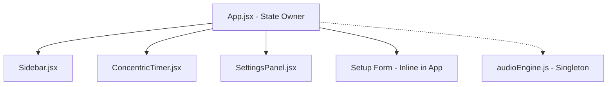
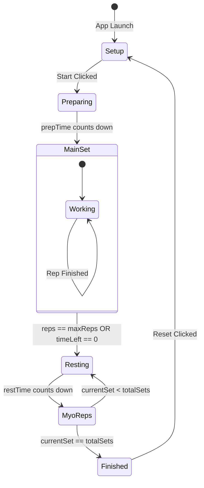

# Myo-Rep Timer - Version 2.3.0

## 1. Project Overview

The Myo-Rep Timer is a high-performance, single-page React application designed for the **Myo-rep training protocol**. It features a robust state machine, a persistent Picture-in-Picture (PiP) implementation, and a specialized audio engine with cross-browser fail-safes.

### 1.1. Core Features (v2.3.0)
- **Advanced State Machine**: Handles Prep -> Main Set -> Rest -> Myo Sets -> Finish.
- **Robust Audio Engine**: Hybrid TTS system with Web Speech API and Web Audio API tone fallbacks (optimized for Brave).
- **Persistent PiP**: Drawing engine on `<canvas>` captured to a `<video>` stream, surviving workout resets.
- **Dynamic UI**: Concentric circular timer with real-time scaling and smooth animations.
- **Redesigned Settings**: 2-column grid layout for high density and clear categorization.

---

## 2. Program Structure & Architecture

### 2.1. File Map
```text
src/
├── App.jsx                # ROOT: State Management, Workout Logic, PiP Streamer
├── components/
│   ├── Sidebar.jsx        # Navigation & Versioning
│   ├── ConcentricTimer.jsx# VISUAL: SVG Drawing & Progress Logic
│   ├── SettingsPanel.jsx  # CONFIG: UI for DEFAULT_SETTINGS overrides
├── utils/
│   ├── audioEngine.js     # AUDIO: Web Speech API & Tone Fallback Logic
│   ├── timerWorker.js     # CORE: Background thread for sub-millisecond accuracy
```

### 2.2. Component Hierarchy


---

## 3. Detailed Logic Diagrams

### 3.1. Workout Lifecycle (State Machine)


### 3.2. Audio Engine Fallback (Natural Voice)
This is critical for Brave/Chromium compatibility where TTS voices may be blocked.
```mermaid
flowchart TD
    Start[audioEngine.speak(text)] --> CheckVoices{Voices Available?}
    CheckVoices -- Yes --> UseTTS[SpeechSynthesisUtterance]
    CheckVoices -- No --> BraveFallback[Brave Fallback: speakWithTones]
    
    UseTTS --> TTS_Success[Natural Voice Output]
    UseTTS -- Error --> BraveFallback
    
    BraveFallback --> Map[Map Text to Frequency/Pattern]
    Map --> WebAudio[Web Audio API - Sine Wave]
    WebAudio --> ToneOutput[Melodic Tone Output]
```

---

## 4. Key Implementation Details (For Future Agents)

### 4.1. The PiP "Survival" Trick
To keep PiP active across workout resets, the `canvas` and `video` elements are placed in a **Persistent Container** at the bottom of `App.jsx`. 
- **Drawing**: A `useEffect` in `App.jsx` draws every frame to the canvas based on centralized state.
- **Streaming**: `video.srcObject = canvas.captureStream()` is called once on mount.

### 4.2. Sub-millisecond Accuracy
The app uses a **Web Worker** (`timerWorker.js`) to handle intervals. Standard `setInterval` is throttled by browsers in background tabs, but Workers maintain priority, preventing timer desync during long rests.

### 4.3. Brave TTS Fix
Brave often returns `window.speechSynthesis.getVoices() = []`.
- `audioEngine.js` detects this and automatically triggers `speakWithTones()`.
- Tone patterns are melodic (ascending for "Start", descending for "Rest").

---

## 5. Maintenance & Versioning

### Current Version: 2.3.0
- **Changes in 2.3.0**:
    - Redesigned Settings Panel.
    - Added PiP Info Toggle (Sets/Reps visibility).
    - Implemented Brave Tone Fallback.
    - Added "Finished Color" configuration.
    - Updated Sidebar Versioning.

---

## 6. Development

Run locally:
```bash
npm install
npm run dev
```

Build:
```bash
npm run build
```
