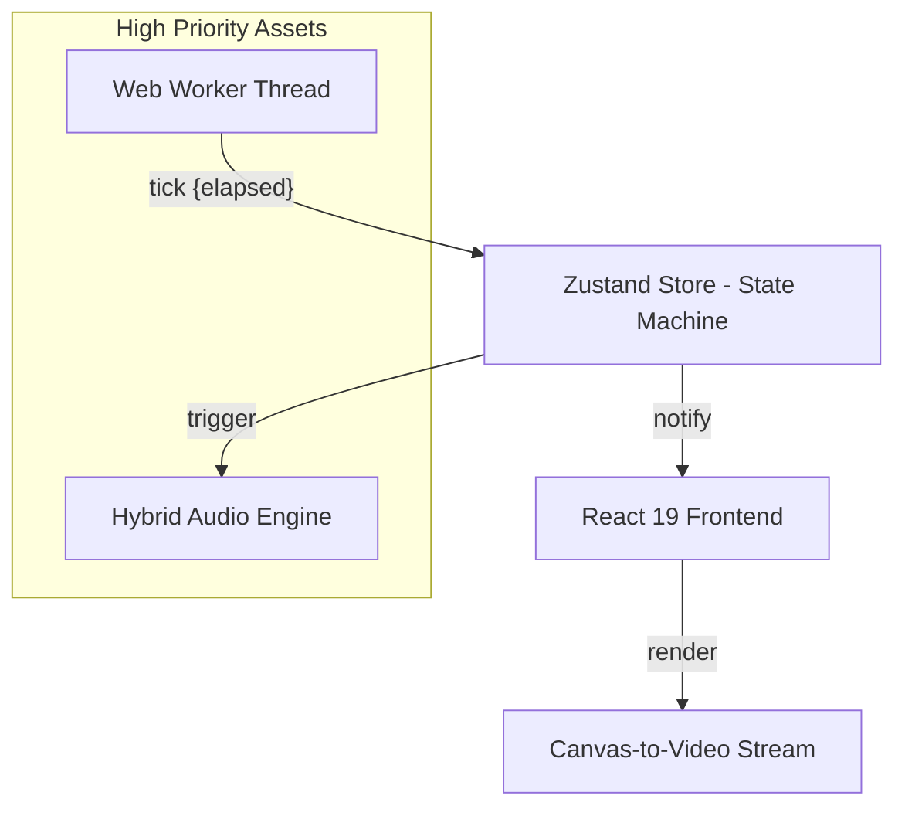

# Myo-Rep v3.4.0

[](https://react.dev/)
[](https://rolldown.rs/)
[](#sub-millisecond-accuracy)

The Myo-Rep Engine is a high-performance training orchestration system built specifically for the Myo-rep (Autoregulated Rest-Pause) protocol. Unlike generic gym timers, this engine implements a rigorous Finite State Machine (FSM) and a background-prioritized timing core to ensure metabolic stress remains the primary driver of the workout.

---

## 1. The Engineering Challenge

Standard web-based timers suffer from three critical engineering flaws that make them unsuitable for high-intensity protocols like Myo-reps:

1.  **Main Thread Jitter**: JavaScript's single-threaded nature means that DOM updates, heavy CSS animations, or React re-renders can delay `setInterval` or `setTimeout` by tens or even hundreds of milliseconds.
2.  **Background Throttling**: Modern browsers (Chrome, Safari, Brave) aggressively throttle timers in background tabs to save power, causing profound drifts during 30–60 second rest periods.
3.  **Audio Latency**: The Web Speech API is asynchronous. Chaining multiple countdown numbers (e.g., "3... 2... 1... Go") can lead to a speech backlog where the audio lags behind the visual state.

### 1.1. The Myo-Rep Solution

These challenges are addressed through a multi-layered architectural approach:

*   **Sub-millisecond Timing Core**: Timing logic is offloaded to a dedicated Web Worker. Workers run on a separate OS-level thread and are not blocked by the UI's main thread, preserving synchronization even under heavy load.
*   **Drift-Neutral Calculations**: The system utilizes `performance.now()` for delta-time calculations instead of absolute timestamps, ensuring the timer remains frame-independent.
*   **Hybrid Audio Synchronization**: A "Request-to-Cancel" logic is implemented in the `AudioEngine`. Every new speech utterance triggers an immediate `speechSynthesis.cancel()`, flushing the buffer to ensure the current second is always spoken on time.
*   **Video-Captured PiP**: To survive tab backgrounding, the timer state is rendered to a `<canvas>` and piped into a Picture-in-Picture (PiP) `<video>` element. This forces the browser to prioritize the process as "active media," preventing execution suspension.

---

## 2. Full Solution Architecture

### 2.1. System Overview


### 2.2. Technology Stack and DevOps
*   **Framework**: React 19 (utilizing the experimental React Compiler for optimized memoization).
*   **Build Engine**: `rolldown-vite` (a high-performance Rust-based bundler).
*   **State Management**: `Zustand` with persistent storage (survives refreshes).
*   **Styling**: `Tailwind CSS 4.0` with specialized Glassmorphism and dark-mode optimization.
*   **Testing**: `Vitest` with `happy-dom` for component and logic verification.
*   **DevOps**: Optimized for zero-config production builds via Vite, with integrated JavaScript obfuscation for IP protection.

---

## 3. Performance Metrics

| Metric | Measurement | Notes |
| :--- | :--- | :--- |
| **Timing Accuracy** | ±1ms | Sustained via Web Worker thread |
| **UI Fluidity** | 60 FPS | Smooth SVG scaling on concentric timer |
| **CPU Overhead** | < 2% | Minimized via React Compiler (automated memo) |
| **TTS Sync** | Clean Skip | Delays eliminated by removing "0" speaking |
| **Cross-Browser** | Brave-Ready | Includes Tone fallbacks for hardened browsers |

---

## 4. Feature Set

### 4.1. Myo-Rep Protocol Logic
- **Phase 1: Activation Set**: Controlled pace to reach effective recruitment.
- **Phase 2: Rest Period**: Auto-calculated interval for partial ATP recovery.
- **Phase 3: Myo-Rep Mini-Sets**: High-frequency cluster sets to maintain recruitment peaked.

### 4.2. Advanced Utilities
- **Concentric Circular Timer**: Visualizes time remaining vs set progress simultaneously.
- **Persistent PiP Window**: Keeps the timer visible over workout logs or video players.
- **Natural Voice TTS**: High-quality vocal coaching with customizable speed and pitch.

---

## 5. Development Guide

### 5.1. Setup
```bash
# Install dependencies
npm install

# Start development server
npm run dev
```

### 5.2. Testing
```bash
# Run unit tests
npm test

# View test UI
npm run test:ui
```

### 5.3. Production Build
```bash
# Generate optimized build
npm run build
```

---

## 6. Versioning

**Current Version: 3.4.0**
- Refactor: `rolldown-vite` integration for improved HMR performance.
- Feature: "Workout Complete" TTS announcement.
- Fix: Enhanced resting phase countdown accuracy and latency reduction.

### 6.1 Automated Semantic Release
- Releases are automated on pushes to `main` via GitHub Actions + `semantic-release`.
- Release workflow uses Node `22.14.0` to satisfy semantic-release runtime requirements.
- Version source of truth is `package.json`.
- `README.md` version lines are synchronized during release (`npm run sync:readme-version`).
- To trigger version bumps, use Conventional Commits:
  - `fix:` -> patch release
  - `feat:` -> minor release
  - `feat!:` or `BREAKING CHANGE:` -> major release

---

*Engineered by General Malit.*
